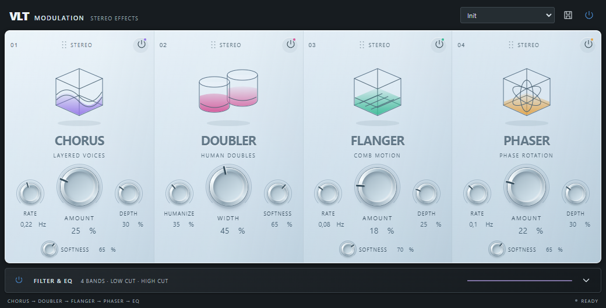

# Modulation: HTML editor and serial effect rack

`daw.modulation` adds Chorus, Doubler, Flanger and Phaser in one serial chain.
The four standalone plugins remain available; they share the updated algorithms
and the local HTML/CSS/SVG editor. Doubler Pro uses the same card design with all
six of its controls retained.

[Expanded EQ](evidence/Modulation-expanded.png) · [Standalone Chorus](evidence/Chorus.png)

The card handle drags horizontally; clicking it opens Move left / Move right.
Alt + Left / Right also changes order. Each card has an independent power button.
Module parameter IDs stay attached to their effects when reordered. Module
bypass fades over 5 ms; order changes fade briefly through the dry signal before
switching topology. The rack reports zero latency and allocates no memory in
processing, including parameter events and host blocks larger than its scratch
buffer.

One Filter & EQ section follows the modules. It opens collapsed, with an actual
response preview. Expanding exposes four bell bands, Low Cut and High Cut.
Dragging points changes frequency/gain; the wheel changes Q. Numeric controls
and keyboard editing are also available. EQ is implemented by the existing
Equalizer DSP, with parameter events forwarded to its audio-thread targets.
Its reset now synchronizes smoothing to current parameters for deterministic
project restore and transport resets.

The modulation drive and movement ranges are doubled relative to v2. Chorus
uses twice the delay excursion and Amount drive. Flanger and Phaser use twice
the mix drive and sweep depth. Doubler uses twice the humanization excursion,
pitch-motion limit and Width drive. Mix and stereo energy remain bounded at
extreme settings; this is stronger processing, not a 6 dB output-gain boost or
a claim of exactly double perceived intensity. Standalone parameter IDs and
state schema remain compatible; existing sessions will sound different.

HTML resources are bundled under `qrc:/vlt/modulation/`, without remote content.
The bounded WebChannel bridge routes all edits through the controller, retains
the existing user-preset format and groups pointer gestures into one undo step.
Illustrations animate during playback and respect reduced motion. Hidden
editors stop their timer and animations.

Validation targets: `modulation_test`, `modulation_ui_test`, `equalizer_test`,
`plugin_insert_test`, `plugin_scan_test`, `collaboration_protocol_test`,
`cloud_project_test`; backend `go test ./internal/collab`.
The DSP tests exercise all 24 orders, bypass nulling, standalone/rack identity,
filter response, state round-trip, sample-offset automation, mono layouts,
extreme settings and allocation-free processing. The HTML test covers real
pointer gestures, keyboard controls, presets, automation, project reopening,
disclosure, rendered pixels and minimum width. Screenshots can be produced with
`modulation_ui_test --screenshots <directory>`.
