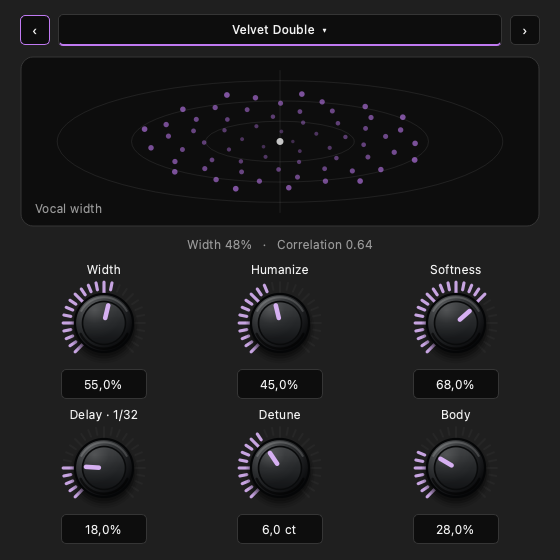

# Модуляторы v2 и Doubler Pro

Chorus, Flanger, Phaser и Doubler получили более выраженную обработку. Добавлен
отдельный встроенный **Doubler Pro**, UID `daw.doubler-pro`, с десятью пресетами.
Обновлённая сборка: `build/bin/VLTONE`.

## Что изменилось в звуке

- **Doubler:** четыре голоса с более живыми, независимыми отклонениями задержки;
  скорость изменения ограничена примерно 12 центами. Ручка ширины стала
  действеннее в середине диапазона. Сохранены ограничение добавленного Side,
  защита согласных и точное восстановление исходного сигнала при суммировании в моно.
- **Chorus:** увеличен размах изменения задержек и различие скоростей четырёх
  голосов; изменены кривая Amount и баланс сухого и обработанного сигнала.
- **Flanger:** более широкий музыкальный проход короткой задержки, заметнее
  обратная связь и глубже гребенчатая окраска. Обратная связь ограничена и
  фильтруется; компенсировано падение уровня при подмешивании.
- **Phaser:** восемь секций вместо шести, более широкий проход и выраженная
  обратная связь. Коэффициенты рассчитываются раз в 16 отсчётов и непрерывно
  интерполируются между ними. Это уменьшает число дорогих вычислений без ступеней
  в движении фильтров. Компенсировано падение уровня смеси.

В основе Chorus и Flanger остаются модулируемые задержки; для Phaser используются
последовательно соединённые allpass-фильтры. Принципы сверены с первичным источником
Julius O. Smith: [Time-Varying Delay Effects](https://dsprelated.com/freebooks/pasp/Time_Varying_Delay_Effects.html)
и [Classic Analog Phase Shifters](https://www.dsprelated.com/freebooks/pasp/Classic_Analog_Phase_Shifters.html).
Реализация и настройка параметров выполнены в коде проекта.

Softness фильтрует добавленные голоса, оставляя исходный вокал основой звучания.
Изменения параметров сглаживаются. У Doubler Pro защита атак применяется также
к дополнительным слоям. Жёсткий клиппер для усиления эффекта не добавлялся.

## Doubler Pro

| Ручка | Назначение |
|---|---|
| Width / Ширина | Размещение дублей по сторонам |
| Humanize / Живость | Естественные отклонения времени и высоты |
| Softness / Мягкость | Смягчение добавленных голосов и ярких согласных |
| Delay / Дилей | Независимая громкость эха длиной 1/32 ноты; ноль выключает эхо |
| Detune / Расстройка | Дополнительные голоса с противоположными отклонениями высоты, до ±16 центов |
| Body / Плотность | Мягкий дополнительный дубль по центру, слышимый и в моно |

На 120 BPM дилей составляет 62,5 мс, на 60 BPM — 125 мс. В исключительно медленных
проектах он ограничен 375 мс, чтобы оставаться коротким вокальным эхом; ограничение
указано в подсказке. Обратная связь фиксирована на 18%. Смена темпа использует
30-миллисекундный переход между двумя задержками, без скольжения головки чтения.
Повторное изменение темпа во время перехода применяется после его завершения.

Detune использует две головки чтения с комплементарными окнами Hann, скрывающими
перенос головки. Нулевая расстройка выключает этот слой. Body и Delay работают
независимо от ширины. Поэтому полная отмена эффекта в моно — свойство обычного
Doubler; Pro намеренно оставляет слышимые центральные слои и эхо.

| Before | After | Why |
|---|---|---|
| У обычного Doubler три ручки | У Pro шесть ручек в двух рядах по три | Основные настройки отдельно от дополнительных слоёв |
| Общий числовой формат процентов | Проценты для уровней, центы для Detune, ритм рядом с Delay | Значения однозначны при вводе и автоматизации |
| Новые подписи отсутствовали | Русские названия, подсказки и описания для экранного диктора | Новые элементы соответствуют локализованному интерфейсу |

Панель использует существующие Qt-контролы, темы, клавиатурное управление,
числовой ввод и отмену. Проверены минимальная ширина 440 px и открытие в реальном
окне приложения с Metal. Ниже — отдельный снимок панели в английской локализации.



## Сравнение на одинаковом сигнале

Одинаковый синтетический источник гласных и согласных, 48 кГц, 8 секунд, стандартные
настройки. Каждый обработанный сигнал сначала приведён к RMS исходника. Затем
вычтена его проекция на исходник и измерен остаток. Метрика показывает изменение
сигнала, а не субъективную оценку качества вокала.

| Эффект | Рост остатка после выравнивания RMS | Итоговое изменение RMS без выравнивания |
|---|---:|---:|
| Doubler | +3,15 дБ | +0,53 дБ |
| Chorus | +12,67 дБ | −0,56 дБ |
| Flanger | +7,41 дБ | −0,23 дБ |
| Phaser | +7,18 дБ | −0,25 дБ |

Базовый DSP взят из `ad610e84674fd646bb64c9ed0cd144d17aa59de9` до изменений этого
запроса. [Измерения и хеши исходных рендеров](modulation-evidence/comparison.json).

[Короткий A/B-пример](modulation-evidence/doubler-pro-synthetic-ab.wav):
0–4 с — сухой синтетический источник, 4–8 с — Doubler Pro с пресетом Velvet Double,
громкость выровнена. Это синтетический тест, не запись певца; оценка на конкретном
вокальном материале пользователя ещё не проводилась.

## Проверки и совместимость

- `modulation_test`: пять алгоритмов, все 50 пресетов, частоты 44,1/48/96/192 кГц,
  блоки 1/64/257/1024, тишина, импульсы, крайние параметры, нечисловой вход,
  сглаживание автоматизации, хвост и отсутствие выделений памяти при обработке.
- Для Pro отдельно: ритмическое время дилея на разных темпах и частотах,
  пропорциональность его уровня, независимость дополнительных слоёв, повторная
  смена темпа во время перехода, некорректный темп, затухание при максимальной
  задержке. Нулевая громкость всех слоёв даёт точный сухой сигнал.
- `modulation_ui_test`: пресеты, отмена, новые единицы измерения и ID автоматизации,
  сохранение всех параметров в проекте, повторное открытие, дублирование,
  экспорт, минимальные размеры, темы и остановка анимации скрытой панели.
- `collaboration_protocol_test` и `cloud_project_test`: каталог и разрешённые
  встроенные эффекты учитывают новый UID. Все четыре CTest-набора прошли.
- В аппаратной проверке основного приложения отрисовались GPU-кадры и панель Pro.
  [Телеметрия открытия](modulation-evidence/gpu-opening.json) относится к короткому
  запуску с построением интерфейса, не к замеру стабильной производительности.
- Сборка `daw` с обновлённым русским каталогом и `git diff --check` прошли.

UID, индексы и диапазоны параметров четырёх существующих эффектов сохранены,
состояние остаётся версии 1. Их сохранённые пресеты совместимы, но звучание
обновляется вместе с DSP. Pro имеет отдельный UID и не заменяет обычный Doubler.
Задержка прямого сигнала у всех пяти эффектов — ноль отсчётов.

Повторить проверки:

```sh
cmake --build build --target daw modulation_test modulation_ui_test collaboration_protocol_test cloud_project_test -j4
ctest --test-dir build -R '^(modulation_test|modulation_ui_test|collaboration_protocol_test|cloud_project_test)$' --output-on-failure
build/bin/modulation_test --examples /tmp/modulation-examples
QT_QPA_PLATFORM=offscreen build/bin/modulation_ui_test --screenshots /tmp/modulation-panels
```
