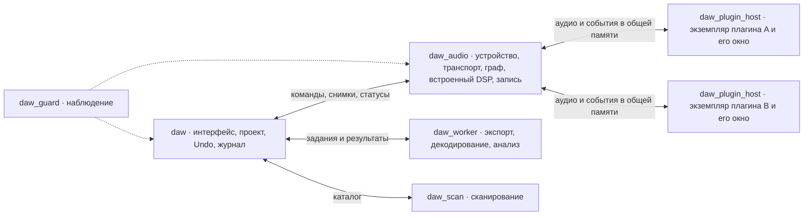

# План изоляции аудиодвижка и модулей VLTONE

Статус на 8 октября 2026 года: основной `EngineController` использует `daw_audio` через процессный endpoint; внешние плагины работают в собственных хостах, экспорт, декодирование и анализ — в `daw_worker`. Реализованы пакетные показания, несколько сессий, откат, восстановление процесса и прерванной записи, наблюдение за открытым редактором плагина с heartbeat его очереди событий. Производственный путь не выбирает локальный движок при отказе helper. Остаются аппаратная и кроссплатформенная приёмка и устранение ожиданий control IPC в вызывающем UI-коде. Подробности и подтверждённые проверки — в [отчёте о реализации](../implementation/process-isolation.md). Исходный аудит ниже относится к ревизии `daf811a`.

Предлагается сохранить существующий аудиограф и DSP, а исполнение разделить между процессами. Проектом и историей редактирования владеет приложение. Аудиоустройством и графом владеет отдельный движок. Каждый внешний плагин по умолчанию работает в собственном процессе. Экспорт и обработка файлов выполняются в отдельных рабочих процессах. Сбой одного исполнителя не должен уничтожать документ.

Это большой рефакторинг границ владения, вызовов и восстановления. Переписывать алгоритмы микширования, растяжения, автоматизации и компенсации задержки для него не требуется.

## Ожидаемое поведение

| Сбой | Поведение после завершения миграции |
| --- | --- |
| Плагин падает при загрузке, DSP, работе редактора или сохранении состояния | Его процесс завершается. Слот остаётся в проекте с настройками и кнопкой перезапуска. Независимые ветки графа продолжают работать. |
| Плагин зависает | Движок прекращает ждать по аудиодедлайну и выдаёт определённый запасной сигнал. Контрольный поток обнаруживает зависание и завершает процесс. |
| Плагин выдаёт ошибку, NaN или некорректный протокол | Результат отвергается, слот переводится в состояние ошибки. Повреждённые события и аудио не публикуются дальше по графу. |
| Падает сам аудиодвижок или встроенный DSP в нём | Звук и текущая запись прерываются. Интерфейс, документ и Undo остаются доступны. Движок можно запустить заново и восстановить из состояния приложения. |
| Падает экспорт, декодер или анализатор | Завершается конкретное задание. Исходники и уже опубликованные версии клипов сохраняются. |
| Падает интерфейс | Работает существующее восстановление с диска. Потерю ещё не записанных изменений полностью исключить нельзя. |

На master или общей шине неисправный плагин может заглушить всё, что от него зависит. «Продолжают работать другие плагины» не означает, что любая связанная цепь сохранит прежний звук. Перезапуск не восстанавливает точную фазу генератора, хвост реверберации и голоса, если сам формат состояния плагина их не сохраняет.

У Bitwig документированы отдельные процессы плагинов, перезагрузка после сбоя и режимы группировки. Это ориентир для поведения; описание «каждый компонент программы в своём контейнере» не следует из этой документации. [Руководство Bitwig](https://www.bitwig.com/userguide/latest/vst_plug-in_handling_and_options/).

## Исходный аудит перед миграцией

| Часть | Текущее состояние | Что использовать при миграции |
| --- | --- | --- |
| [Цели сборки](../../CMakeLists.txt) | `daw_engine`, `daw_core`, `daw_controller`, `daw_pluginhost` являются библиотеками внутри процесса приложения | Сохранить границы библиотек; добавить границы процессов поверх них |
| [RealtimeEngine](../../engine/Engine/RealtimeEngine.hpp) и [GraphProcessor](../../engine/Graph/GraphProcessor.hpp) | Граф, планировщик, атомарная публикация и отложенное освобождение графов | Сохранить DSP, PDC, порядок суммирования и текущие тесты |
| [PluginInstance](../../plugins/Host/PluginInstance.hpp) | Общий интерфейс CLAP, VST3, VST и AU, состояние, параметры, редактор | Использовать как локальный интерфейс внутри процесса плагина; сделать отдельный удалённый адаптер |
| [PluginManager::instantiate](../../controller/plugins/PluginManager.cpp) | Вызывает `factory->create` в текущем процессе. Маркер краша помогает диагностике, но не изолирует сбой | Здесь переключать создание внешних экземпляров на процесс хоста |
| [PluginNode](../../plugins/Host/PluginNode.cpp) | Прямой вызов `m_instance->process`; есть проверка возвращённой ошибки и конечности аудио | Добавить состояние отказа и определённый запасной выход; аппаратный краш не успеет вернуть `Error` |
| [daw_scan](../../scanner/scan_main.cpp) и [ScanProcess](../../controller/plugins/ScanProcess.hpp) | Сканирование уже изолировано, есть таймауты и обработка завершения | Переиспользовать опыт запуска, ограничения и диагностику; одноразовый протокол сканера не превращать в аудиотранспорт |
| [EngineController](../../controller/EngineController.hpp) | Владеет документом, движком и записью, выдаёт указатели на живые экземпляры | Постепенно отделить редактирование документа от исполнения |
| [PluginEditorWindow](../../app/PluginEditorWindow.cpp) | Вызывает методы плагина; встроенные панели выбираются через конкретные типы DSP | Удалить прямые связи UI с живым DSP до выноса всего движка |
| [RecoveryJournal](../../controller/recovery/RecoveryJournal.hpp) | Пишет неизменяемый снимок документа и заранее полученные байты состояния | Сохранить формат восстановления, добавить версии подтверждённых состояний процессов |
| [daw_guard](../../guard/guard_main.cpp) и [reporter](../../reporter/CMakeLists.txt) | Отдельные наблюдатель и отправитель диагностики | Расширить наблюдение за ролями процессов, не переносить в них модель проекта |
| [Экспорт](../../controller/EngineControllerRender.cpp) | Собирает снимок и создаёт отдельный экземпляр исполнения внутри процесса | Использовать существующий снимок как основу задания внешнему рендереру |

Корневой `ARCHITECTURE.md` описывает ранний черновик. Для миграции исходной точкой служат текущие исходники, [BUILD.md](../../BUILD.md), [AUDIO_PERFORMANCE.md](../AUDIO_PERFORMANCE.md) и тесты.

## Границы процессов

Основной UI использует `daw_audio`; тот размещает внешние экземпляры в `daw_plugin_host`. Для экспорта и файловых заданий используется `daw_worker`. Статическая библиотека `daw_engine` сохраняет общую реализацию DSP для исполнителей. На схеме `daw_guard` обозначает целевой отдельный supervisor; текущий жизненный цикл аудиопроцесса контролируется broker в приложении.

**Процесс приложения.** Qt, документ, команды редактирования, Undo/Redo, облачная синхронизация и журнал восстановления. Здесь хранятся последние подтверждённые состояния плагинов. Интерфейс получает данные о звуке как снимки и показания, не читает поля графа и не вызывает SDK плагинов.

**Процесс аудиодвижка.** PortAudio, realtime-граф, транспорт, MIDI I/O, PDC, PCM-кэш, встроенные инструменты и запись. Главный поток устройства остаётся рядом с графом, чтобы не добавлять отдельную обязательную границу IPC между ними. Транспорт исполнения и время устройства принадлежат движку; интерфейс получает их временные метки для отображения.

**Процесс плагина.** Загрузка модуля, экземпляр, DSP, состояние и нативный редактор. VST3 processor и controller остаются вместе. Фоновые потоки плагина также живут здесь: изолировать только вызов `process` недостаточно. Разные экземпляры одного DLL при индивидуальном режиме находятся в разных процессах.

**Рабочие процессы.** Ограниченный пул одноразовых заданий для рендера, декодирования и анализа. На первом этапе одно задание на процесс, без одновременного выполнения несвязанных задач в одном адресном пространстве. Компилятор Creator и выполнение его DSP рассматриваются отдельно: внешний компилятор не делает работающий DSP изолированным. WASM/AOT уже имеет свой runtime; для его защиты от падения runtime используется та же граница рабочего процесса плагина.

**Встроенные модули.** Простые доверенные узлы — фейдеры, сумматоры, метры — остаются в движке. Ошибка такого узла может остановить весь движок, но не должна уничтожить проект. Для сложного встроенного инструмента и Creator допускается индивидуальный процесс после отделения панели от DSP. Разносить каждую ручку и арифметический узел по процессам не требуется.

Изоляция здесь означает ограничение последствий падения. Ограничение доступа плагина к файлам и сети — отдельная задача: обычный дочерний процесс не является защитной песочницей для вредоносного кода. Docker и отдельные сетевые сервисы для аудиопути не нужны.

## Режимы хостинга

Начальный режим для внешних плагинов — **по экземпляру**. Только он соответствует обещанию «сломался один плагин, остальные экземпляры сохранились».

После измерений можно добавить явные группы совместимости, например для плагинов, обменивающихся данными внутри одного процесса. У группы общий риск: сбой любого участника останавливает всех участников. Группы по производителю или всей дорожке не нужны для первого рабочего выпуска.

Приложение использует отдельный процесс для каждого внешнего экземпляра; пользовательский переключатель локального хостинга удалён. Автоматического перехода к загрузке внешнего плагина в UI или `daw_audio` нет. Низкоуровневый локальный адаптер необходим самому `daw_plugin_host` для работы SDK и тестам форматов.

## Контракты вместо указателей

Нужно разделить `EngineController` по фактическому владению, сохранив его внешний фасад на время миграции:

| Контракт | Назначение |
| --- | --- |
| `RenderSessionSpec` | Описание исполнения из документа: устойчивые ID, маршрутизация, источники, tempo map, автоматизация, параметры и ссылки на подтверждённые состояния |
| `EngineClient` | Отправка команд движку и приём подтверждений, статусов, ошибок и показаний |
| `AudioRuntime` | Применение описания исполнения, владение графом, устройством, плагинами и рекордерами |
| `RemotePluginInstance` | Адаптер метаданных, состояния и управления удалённым плагином; локальные геттеры читают кэш |
| Представления встроенных модулей | Параметры, огибающие, формы волн и измерения для Qt-панелей без `SamplerInstance*`, `SlicerInstance*` и других указателей DSP |

Контракт `EngineClient` реализован как `AudioRuntimeEndpoint`, а удалённый плагин — общим адаптером процессного хоста. Явные владельцы runtime для тестов и offline worker используют те же команды; обычный контроллер выбирает только процессный endpoint. Периодические геттеры читают кэш, точные операции редактирования запрашивают подтверждённое состояние.

Документ в приложении — источник истины. Движок держит исполняемую проекцию. Каждая структурная команда несёт ревизию проекта и ID команды; подтверждение содержит принятую ревизию и поколение графа. После разрыва связи отправляется полный снимок и затем ещё не применённые команды. Повтор команды не должен дважды добавлять слот или запускать запись. Устаревшие ответы после Undo, удаления слота или перезапуска отбрасываются.

События редактора плагина возвращаются в существующий путь изменения документа и автоматизации. Облачный редьюсер и Undo остаются владельцами своих правил; локальный статус падения не становится общей командой удаления или отключения плагина у других участников.

## Два канала обмена

**Управление.** Локальные pipes или сокеты, версионированный конверт и ограниченные размеры сообщений. Уже используемый JSON подходит для редких команд загрузки, списка параметров и диагностики; новые зависимости для этого не требуются. Поля включают версию протокола, роль, ID сессии, ID слота, поколение процесса и номер запроса. Нужны лимиты очередей, отмена и отдельные дедлайны для загрузки, состояния и завершения. Нативные диалоги авторизации плагина могут требовать времени; GUI остаётся отзывчивым, отмена доступна.

Чтение и запись control IPC выполняются вне аудиопотока и вне блокирующего участка UI. Переполнение команды редактирования возвращает явный результат. Показания метров могут заменяться более свежими; команды запуска записи и нотные события так терять нельзя. Вывод плагина в stdout/stderr не смешивается с протоколом, как уже сделано у сканера.

**Аудио и MIDI.** Предварительно выделенная общая память отдельно для каждого процесса плагина. В ней находятся planar float-буферы основных входов, выходов и sidechain, ограниченные массивы событий и описание конкретного блока. Никаких указателей на память движка, STL-контейнеров и виртуальных интерфейсов в передаваемой структуре.

Текущий `PluginProcessContext` содержит указатели и `span`: отправить его байты другому процессу нельзя. Новый формат задаёт явные размеры и смещения, число каналов и кадров, sample rate, sample/steady time, транспорт, tempo/meter, порядок событий и поколение конфигурации. `PluginEvent` тоже требует проверенного wire-представления, а не предположения, что `trivially_copyable` гарантирует IPC-совместимость.

Входы, выходы и управляющие счётчики имеют определённого писателя. Читающая сторона проверяет границы, размеры и номера поколений, а SDK получает локальные буферы ребёнка. Общая память не открывает плагину весь граф или память других плагинов. В Windows для разделяемых буферов подходит file mapping; ручки передаются конкретному ребёнку без глобального объекта и административных привилегий. [Механизм общей памяти Windows](https://learn.microsoft.com/en-us/windows/win32/memory/creating-named-shared-memory).

Имеющиеся межпоточные очереди полезны как образец, но не считаются автоматически пригодными для межпроцессного обмена. Для Windows x64 и macOS arm64/x64 проверяются lock-free атомики, выравнивание, порядок публикации и платформенное пробуждение. `std::atomic::wait` нельзя без проверки переносить в общую память: реализация ожидания может быть локальной для процесса.

Число каналов, кадров, событий, параметров и байтов состояния согласуется до запуска. Существующий предел состояния 256 MiB сохраняется как верхняя граница, а не как размер каждого сообщения или постоянного буфера. Неподдерживаемая конфигурация даёт явную ошибку, а не обрезанные каналы или незаметно потерянный MIDI. Для переполнения событий предусмотрены диагностика и гарантированный сброс удерживаемых нот; sample-accurate автоматизацию нельзя сводить к последнему значению ручки.

## Планирование аудио и задержка

Для первой версии выбирается обработка удалённого узла **в том же аудиоблоке**. Это проектное решение, которое должно пройти измерения на малых буферах до включения по умолчанию.

1. Когда входы узла готовы, планировщик публикует блок плагину и продолжает выполнять независимые узлы.
2. Завершённый ответ с правильным номером блока открывает зависимые узлы. Порядок суммирования, MIDI и автоматизации сохраняется.
3. У всех удалённых узлов один бюджет текущего callback с резервом для оставшегося графа и вывода. Нельзя последовательно ждать каждому плагину полный отдельный таймаут.
4. Если результат не готов к выделенному дедлайну, публикуется запасной выход и граф продолжает завершение. Перезапуск и уничтожение процессов выполняет контрольный поток.
5. Неиспользованный поздний результат отвергается. Пока ребёнок ещё пишет, его область памяти не переиспользуется. После таймаута экземпляр выводится из исполнения; новый запуск получает новое поколение и новую область памяти.

Простой синхронный `RemotePluginInstance::process`, удерживающий поток на ожидании ОС, годится только для стенда IPC. Рабочая интеграция требует разделить отправку и завершение задания в `GraphProcessor`/`JobSystem`. Иначе зависший ребёнок удержит worker или `RenderGate` и снова остановит всё исполнение. Завершение задания по ошибке учитывается ровно один раз, даже при гонке с поздним ответом.

При стратегии одного блока транспорт не добавляет намеренную задержку в целый блок, но добавляет копирование, переключения процессов и джиттер. «Нулевая цена изоляции» не обещается. Если измерения потребуют буферизации, это будет отдельный явно выбранный режим с заявленной дополнительной задержкой. При 128 сэмплах и 48 кГц один дополнительный блок даёт около 2,67 мс; такие задержки на последовательных границах суммируются.

Любая введённая задержка включается в PDC вместе с задержкой плагина. Проверяются dry/wet, параллельные sends, sidechain, MIDI, live monitoring, loop/seek и позиционирование записанного материала. После сбоя удерживается последнее подтверждённое значение задержки до безопасной публикации нового графа. Старые буферы и поколения не могут появиться после seek или смены sample rate.

Realtime-потоки хостов получают соответствующую регистрацию. Нельзя создавать полный пул на все ядра в каждом из ста процессов. Начальная модель — один исполняющий аудиопоток на процесс и общий бюджет параллелизма; внутренние потоки стороннего плагина учитываются измерениями. На macOS Audio Workgroups предназначены в том числе для координации потоков из разных процессов; передачу и повторную регистрацию при смене устройства необходимо реализовать отдельно. [Apple Audio Workgroups](https://developer.apple.com/documentation/audiotoolbox/understanding-audio-workgroups).

## Отказ и перезапуск плагина

Состояния слота: `Unloaded → Starting → Ready → Faulted → Restarting → Ready`. Ошибка запуска или восстановления также ведёт в `Faulted`. Пользовательский bypass и отключённый пользователем слот остаются отдельными свойствами: падение не должно менять музыкальный документ.

Контрольный компонент отслеживает завершение процесса, прогресс DSP и ответы управляющего потока. Живой heartbeat не доказывает, что DSP не завис; открытое окно также не доказывает, что процесс обрабатывает звук. Превышение бюджета CPU отличают от подтверждённого падения. Жёсткий дедлайн всё равно ограничивает участие опоздавшего процесса в текущем графе.

При отказе выход повреждённого плагина заглушается, при возможности с коротким переходом на основе уже проверенных данных. Для инструмента сбрасывается принадлежавшее ему состояние нот. Для эффекта пользователь может явно выбрать обход с сохранением выравнивания по задержке. Автоматический dry bypass не является безопасным универсальным вариантом: на master это может убрать лимитер и резко поднять уровень. Невалидные выходные события MIDI не отправляются до проверки результата блока.

Перезапуск создаёт новый процесс и новый экземпляр с прежним ID слота. Порядок: проверка версии протокола → загрузка модуля → восстановление layout и состояния по требованиям формата → согласование параметров → активация → проверка задержки → публикация на границе блока. Конкретный порядок state/layout/activate определяется адаптером формата; существующие тесты порядка вызовов сохраняются. Вторая половина dual mono имеет собственную идентичность исполнения и состояние.

По умолчанию перезапуск ручной, с отменой и без бесконечного автоматического цикла падений. Повторяемый сбой одного состояния предлагает открыть слот без этого состояния отдельным действием, сохранив исходные байты. Удаление или Undo слота во время запуска отменяет результат. Кнопка перезапуска всех неисправных слотов не трогает работающие экземпляры.

Штатное закрытие имеет ограниченный срок, после которого зависший ребёнок завершается принудительно и reap/cleanup заканчиваются вне аудиопотока. Windows использует владение дочерними процессами и job object; macOS — контролируемый запуск и наблюдение за закрытием канала родителя. Перед созданием новой сессии исключаются оставшиеся старые исполнители. `daw_guard` переживает приложение для диагностики, а аудио и плагины не продолжают бесконечно работать без владельца.

## Состояние проекта и восстановление

Последнее подтверждённое состояние каждого слота хранится **за пределами его процесса**, а после отделения движка — также за пределами движка. В нём есть ID слота, версия/UID плагина, схема параметров, номер снимка и ревизия подтверждённых изменений. Умерший плагин никогда не опрашивается для получения «последнего state».

Снимки запрашиваются при загрузке/смене пресета, явном сохранении, перед важными операциями и с ограниченной частотой при изменении непрозрачного состояния. Если формат требует остановить обработку для `saveState`, паркуется этот экземпляр и применяется объявленная политика выхода. Вызов не должен держать весь `RenderGate` на протяжении чужого кода.

Обычные параметры и автоматизация хранятся в документе. Поверх непрозрачного снимка воспроизводятся только совместимые подтверждённые изменения после его ревизии. Нельзя применять устаревший набор параметров поверх нового пресета или накладывать одни события дважды. Смена списка параметров и layout инвалидирует соответствующий кэш и требует нового согласования.

Для сохранения фиксируется ревизия документа и набор снимков слотов; редактирование может продолжаться в следующей ревизии. Готовые байты пишутся через существующий путь `RecoverySnapshot` и транзакционную публикацию файлов. Неудачный `saveState` не заменяет рабочие байты пустым состоянием. При таймауте явное сохранение получает ошибку конкретного слота и возможность сохранить проект с предыдущим снимком; восстановление автоматически использует последний доступный и показывает его возраст.

Это сохраняет максимум доступной работы, но последние непрозрачные правки в нативном окне могут быть потеряны между снимками. Плагин без state восстанавливается по доступным параметрам. Внешние sample libraries и лицензии остаются отдельными зависимостями — байты состояния не гарантируют их переносимость.

После падения движка приложение сохраняет документ и подтверждённые состояния, запускает новый движок и отправляет актуальную проекцию. Старые процессы плагинов и их сообщения исключаются по поколению сессии. Восстановление устройства и графа может занять время. Воспроизведение возобновляется по действию пользователя; запись автоматически повторно не запускается.

## Редакторы плагинов и встроенные панели

У стороннего плагина нативное окно создаёт его собственный процесс на своём главном потоке. Начальная переносимая реализация — отдельное окно этого процесса с именем дорожки/слота. В приложении остаются статус, автоматизация, список параметров и управление перезапуском. Падение при рисовании редактора тогда не убивает Qt-приложение.

Передать имеющийся `QWidget::winId()` ребёнку как универсальное решение нельзя. В Windows это `HWND`, а на macOS — адрес `NSView`; адрес объекта из другого процесса не становится допустимым через IPC. Qt документирует эти разные типы. Поэтому встраивание окна на Windows и удалённое представление на macOS — отдельные задачи совместимости, не условие первого надёжного выпуска. [Qt Window Hosting](https://doc.qt.io/qt-6/qtdoc-demos-windowhosting-example.html).

В первом рабочем выпуске обязательны корректные DPI, фокус, клавиатура, закрытие окна, нативные файловые диалоги и повторное открытие после сбоя. Передача глобальных DAW-команд учитывает ввод текста в плагине и не перехватывает его произвольно. Плагин получает main-thread callbacks независимо от видимости окна. Его контроллер и редактор не дублируются внутри процесса приложения.

Встроенные панели Sampler, Slicer, EQ, Compressor и остальные сохраняют Qt-интерфейс в приложении. Для них нужны типизированные команды и снимки вместо `dynamic_cast` живого DSP. Большие sample/waveform-данные передаются как неизменяемые ресурсы с ID и управлением временем жизни. Закрытие окна или смена слота не должно оставлять обращение к старому поколению ресурса.

## Запись и фоновые задания

Текущий `DeviceCallback` сначала рендерит граф, затем передаёт аппаратный вход рекордерам и учитывает PDC при размещении записи. При изоляции плагина его дедлайн не должен останавливать захват сырого входа. Отказ графа маркирует нужный участок как прерванный, сохраняя фактически захваченные кадры и корректные временные метки. Запись обработанного сигнала, если появится, потребует собственной политики пропуска.

В целевой базовой схеме устройство и `AudioRecorder` находятся в `daw_audio`. Поэтому падение всего этого процесса обрывает запись. Необходимо восстановление уже записанного PCM, заголовка незавершённого WAV и маркера прерванного take. Кадры, оставшиеся только в RAM, восстановить нельзя. Для непрерывной сырой записи через краш самого движка понадобился бы отдельный процесс устройства/захвата; это отдельное расширение с дополнительным realtime-обменом и проверкой мониторинга.

Экспорт, freeze, bounce и offline clip processing получают неизменяемый снимок проекта и состояния. Один общий механизм задания запускает изолированный runtime. Результат пишется во временную область и публикуется только после успешного завершения и проверки исходной ревизии. Сбой любого нужного плагина завершает экспорт ошибкой: выпускать файл с незаметной тишиной или обходом эффекта нельзя.

Offline не ограничен длительностью одного аудиоблока, но обязан иметь отмену, контроль прогресса и предел зависания. Внешний рабочий процесс ограничен по параллелизму во время живого воспроизведения. Декодирование/анализ повреждённого файла прекращает только своё задание. Работа с исходниками и очистка временных результатов проверяют, что файлы не используются историей и другими заданиями.

## Этапы реализации

Каждый этап должен оставлять собираемую программу и отдельный проверяемый результат. Переключение по умолчанию происходит после проверки, а не одновременно с введением протокола.

Состояние на 8 октября 2026: основной контроллер подключён к `daw_audio` через процессный endpoint; UI не владеет исполняемым DSP. Отдельный helper внешнего плагина, вторичные сессии черновиков, восстановление движка, пакетные показания, восстановление прерванной записи и атомарная замена состояния работают через общие контракты. Экспорт и файловые задачи (decode/probe, темп/тональность, pitch, transients, Slicer) используют `daw_worker` и общий механизм `WorkerJob`. Единственная реализация DSP переиспользуется исполнителями; прямой владелец доступен только явно обозначенным тестам и offline worker.

Этапы 4–6 реализованы на уровне производственного пути; их проверки и актуальные ограничения собраны в [отчёте реализации](../implementation/process-isolation.md). Кроссплатформенная и аппаратная приёмка этапа 7 ещё требует AU/macOS, коммерческих плагинов, подписанного дистрибутива и длительного измерения реального устройства. Успешные headless-проверки не заменяют эти условия. Watchdog открытого GUI реализован и проверен на Windows, включая отзывчивый вложенный цикл событий. Загрузка/сохранение пока могут ожидать ограниченный control timeout в вызывающем UI-коде.
| Этап | Изменения и основные места | Критерий завершения |
| --- | --- | --- |
| 0. Базовые измерения | `tests/fixtures`, `RealtimeMetrics`, существующие `load_bench` и тесты плагинов; контрольные проекты с master/sidechain/dual mono | Воспроизводимые показатели текущей версии и фикстуры падения/зависания во всех стадиях жизненного цикла |
| 1. Процесс и транспорт | Новый `runtime/` для небольшого IPC-контракта и владения процессом; `daw_plugin_host`; тестовый процесс без реальных плагинов | Проверены разрыв канала, поздний ответ, испорченный пакет, несовместимые версии, лимиты и уборка ребёнка; измерен бюджет IPC |
| 2. Изолированная обработка | `PluginManager`, `PluginInstance`/удалённый адаптер, `PluginNode`, `GraphProcessor`, `JobSystem`; сначала CLAP-фикстура | Принудительно падающий или зависший плагин не убивает DAW и не удерживает независимые ветки; sample/MIDI/PDC проходят сравнение с локальным исполнением |
| 3. Полный жизненный цикл плагина | VST3, VST1/2, AU на macOS; состояние, окна, статус и перезапуск; тесты загрузки, удаления, dual mono и Undo | Реальный пользователь может открыть GUI, изменить и сохранить preset, пережить краш и перезапустить тот же слот с последним снимком |
| 4. Отделение документа от исполнения | Постепенное выделение `AudioRuntime` из `EngineController`, `RenderSessionSpec`, команды встроенных панелей и snapshots | UI больше не требует живых указателей DSP; локальный адаптер проходит прежние проверки проекта, встроенных редакторов, записи и облачной синхронизации |
| 5. Отдельный аудиодвижок | `daw_audio`, `EngineClient`, устройство/MIDI/запись, supervisor, recovery и метры | Принудительный краш/зависание движка сохраняет редактируемый проект; перезапуск восстанавливает его без повторного открытия приложения |
| 6. Изолированные фоновые работы | `daw_worker`, экспорт/freeze/bounce, анализ и декодирование; восстановление прерванной записи; Creator | Сбой задания не меняет документ или готовый экспорт; проверены отмена, старые ревизии и временные файлы |
| 7. Выпуск и упрощение | CMake/пакетирование Windows и macOS, подпись помощников, диагностика, совместимость, удаление временных прямых путей | Пройдены проверки форматов и производительности, старые проекты открываются, экспериментальные обходы не включаются молча |

Этапы 1–3 дают первую самостоятельную ценность: защиту внешних плагинов даже до отделения движка. Этапы 4–5 защищают документ от падения DSP и драйверного пользовательского кода. Этап 6 расширяет ту же модель на тяжёлые фоновые задачи.

В сборке SDK форматов доступны сканеру, процессу плагина и тестам адаптеров. Процесс интерфейса не загружает сторонние модули даже ради параметров, preset preview или диалога редактора. Встроенные модели параметров отделяются от реализаций DSP. Проверяется пакет целиком: потерянный или устаревший helper даёт понятную ошибку, а не небезопасный запасной путь.

## Проверки перед включением по умолчанию

**Изоляция.** Тестовые плагины намеренно падают/зависают при create, activate, process, save/load state, открытии/рисовании/закрытии GUI и destroy; отдельно падает их фоновый поток. Проверяются принудительное завершение процесса, отсутствие helper, разные версии IPC, выход за границы сообщения, NaN, перегрузка событий и многократный перезапуск. После отказа одного экземпляра другой экземпляр того же плагина продолжает обрабатывать свой контрольный сигнал.

**Гонки.** Одновременно с отказом выполняются удаление слота, Undo/Redo, save/load, закрытие проекта, sample-rate/device change, offline render и остановка записи. Проверяются устаревшие сообщения, повторные команды и отсутствие использования памяти до окончания работы старого поколения. На macOS нужны проверки arm64 и x64, на Windows — x64; поддержку Windows ARM64 или запуска x86-плагинов этот рефакторинг автоматически не добавляет.

**Звук.** На детерминированных фикстурах сравниваются realtime/offline и локальный/удалённый режимы: кадры, точные позиции событий, PDC, sidechain, sends, mono/stereo/dual mono, tails, slide/MPE, параметры и смены transport. Для недетерминированных сторонних инструментов используются зафиксированные входы и допуски, а не обещание побитового совпадения любого рендера.

**Ресурсы и задержка.** Контрольные цепи 1/10/100 экземпляров, широкие проекты и длинная последовательная master-цепь; 48/96 кГц, буферы 32/64/128/256/512. Сравниваются callback p95/p99/p99.9, максимум, xruns, пропущенные блоки, стоимость передачи, RAM на экземпляр, число потоков, загрузка/закрытие, state capture и максимальная устойчивая нагрузка. Проверка с настоящим устройством выполняется отдельно от сборки и фоновых тестов.

Существующий аппаратный критерий в `AUDIO_PERFORMANCE.md` — минимум 600 секунд, без наблюдаемых xruns/пропущенных callback, RenderGate/PCM gaps и с p99.9 ниже 80% бюджета — сохраняется для штатной нагрузки. Искусственный краш проверяется отдельно: ожидается ограниченный отказ затронутой ветки, отсутствие зависания родителя и отсутствие необъяснённого разрыва в независимых ветках. Целевые нагрузки и допустимая потеря ёмкости по сравнению с базой фиксируются после этапа 1; цифры производительности до измерения не назначаются фактом.

Начальный регрессионный набор: `plugin_contract_test`, `plugin_host_test`, `plugin_insert_test`, `plugin_vst3_test`, `plugin_vst_test`, тесты AU на macOS, `plugin_midi_test`, `plugin_render_state_test`, `engine_graph_test`, `audio_realtime_test`, `offline_pipeline_test`, `render_safety_test`, `processing_render_test`, `track_freeze_test`, `recovery_test`, `audio_monitoring_regression_test`, `controller_test` и `collaboration_protocol_test`. По мере миграции добавляются проверки окон и встроенных редакторов. Наличие этих целей не означает, что они уже проверяют процессную изоляцию.

## Решения до начала каждого следующего этапа

Первым подтверждается бюджет обработки в одном блоке. Если он неприемлем на согласованных устройствах, выбирается явная буферизация или ограничение режима, пересчитываются PDC и критерии live monitoring. Далее подтверждается совместимость окон и лицензирования на реальных плагинах. После этого определяется, какие сложные встроенные модули нуждаются в собственных процессах и нужны ли группы совместимости.

Наиболее трудоёмкие части — завершение удалённых заданий в планировщике, согласованные снимки состояния и удаление прямых связей встроенного UI с DSP. Именно по результату первых работающих этапов можно оценить календарный срок остальной миграции. Критерий полного завершения — проверяемое восстановление плагина, движка и задания, сохранность документа и измеренная работа аудиопути на обеих платформах.
